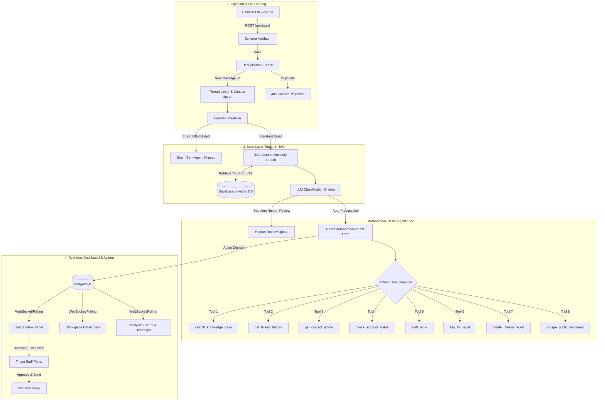

# SenAI Agentic CRM Intelligence Platform

A production-grade, AI-driven Customer Relationship Management (CRM) portal designed to manage high-volume inbox triage. SenAI intercepts incoming emails, parses customer metadata, classifies urgencies, and initiates autonomous **ReAct Triage Agents** via LangGraph. 

Equipped with model-resilient fallbacks (Groq Llama-3.1 + Gemini-3.1), pgvector semantic search (RAG), and public sentiment scraping, SenAI automates support tasks while preserving absolute human oversight through a sleek, modern SaaS dashboard.

---

## 🏗️ Architecture & Data Flow

The diagram below outlines the system pipeline from the moment an email is received to autonomous agent triage, database storage, and real-time dashboard notifications.



---

## ✨ Key Features & Enhancements

*   **100% ReAct Agent Coverage**: Every valid inbox email is routed through the LangGraph ReAct agent loops. Only verified spam or blocklisted domains are filtered out.
*   **Dual-Model Resiliency**: Utilizes Groq (`llama-3.1-8b-instant`) as the core agent engine with an instant fallback to Google Gemini (`gemini-3.1-flash-lite`) on rate limits (429 errors).
*   **Modern Light-Theme UI**: A professional SaaS interface featuring:
    *   Clean white containers, soft gray borders, and generous workspace padding.
    *   Color-standardized urgency badges:
        *   🔴 **Critical**: Soft Red (`bg-red-50 text-red-700`)
        *   🟠 **High**: Orange (`bg-orange-50 text-orange-700`)
        *   🟡 **Medium**: Amber (`bg-amber-50 text-amber-700`)
        *   🔵 **Low**: Blue (`bg-blue-50 text-blue-700`)
    *   Softer sentiment markers and highlighted inline email entities (prices, tickets, policy filenames).
*   **Analytics Workspace**: Modern KPI summary cards, SVG sentiment timeline tracking, category distribution graphs, and a day-of-week response time heatmap.
*   **RAG Knowledge Base**: A vector-search debugger panel to run semantic checks against seeded markdown policy files.

---

## 🛠️ Technology Stack

*   **Backend**: Python (FastAPI) + SQLAlchemy (Async) + Alembic + Uvicorn
*   **Database & Vector Store**: Supabase PostgreSQL with the `pgvector` extension
*   **AI Integration**: Groq API + Google GenAI SDK + SentenceTransformers (`all-MiniLM-L6-v2`)
*   **Frontend**: React (Vite) + TypeScript + Tailwind CSS v4 + Lucide Icons + custom SVG metrics charts

---

## ⚙️ Configuration (.env)

Create a configuration file at `backend/.env` containing the following values:

```ini
DATABASE_URL=postgresql+asyncpg://<username>:<password>@<host>/<database>
GROQ_API_KEY=gsk_...
GEMINI_API_KEY=AIzaSy...
LLM_MODEL=llama-3.1-8b-instant
EMBEDDING_MODEL=all-MiniLM-L6-v2
EMBEDDING_DIMENSION=384
KNOWLEDGE_BASE_DIR=../../knowledge_base
EMAIL_DATA_FILE=email-data-advanced.json
PORT=8000
FRONTEND_URL=http://localhost:5173
```

---

## 🚀 Quick Start Guide

### Prerequisites
*   Python 3.11+
*   Node.js 18+ and npm
*   A running PostgreSQL database with the `pgvector` extension.

---

### Step 1: Set Up the Backend
1.  Navigate to the backend directory and set up your virtual environment:
    ```bash
    cd backend
    python -m venv .venv
    # Windows:
    .venv\Scripts\activate
    # macOS/Linux:
    source .venv/bin/activate
    ```
2.  Install dependencies:
    ```bash
    pip install -r requirements.txt
    ```
3.  Apply database migrations to build the schema:
    ```bash
    alembic upgrade head
    ```

---

### Step 2: Seed Vector Embeddings
Index the policy files inside the `knowledge_base/` folder into Supabase pgvector:
```bash
$env:PYTHONPATH="." # On Windows Powershell
python scripts/seed_kb.py
```

---

### Step 3: Run the Services
1.  **Launch Backend**: Run the FastAPI server on port 8000:
    ```bash
    python -m uvicorn app.main:app --host 127.0.0.1 --port 8000
    ```
    *API documentation will be accessible at: [http://127.0.0.1:8000/docs](http://127.0.0.1:8000/docs)*.

2.  **Launch Frontend**: In a new terminal, run:
    ```bash
    cd frontend
    npm install
    npm run dev
    ```
    *Access the CRM interface at: [http://localhost:5173](http://localhost:5173)*.

3.  **Stream Emails (Simulation)**: Stream the 60 email simulation dataset into the pipeline:
    ```bash
    cd backend
    python scripts/simulate_emails.py --speed 5.0
    ```
