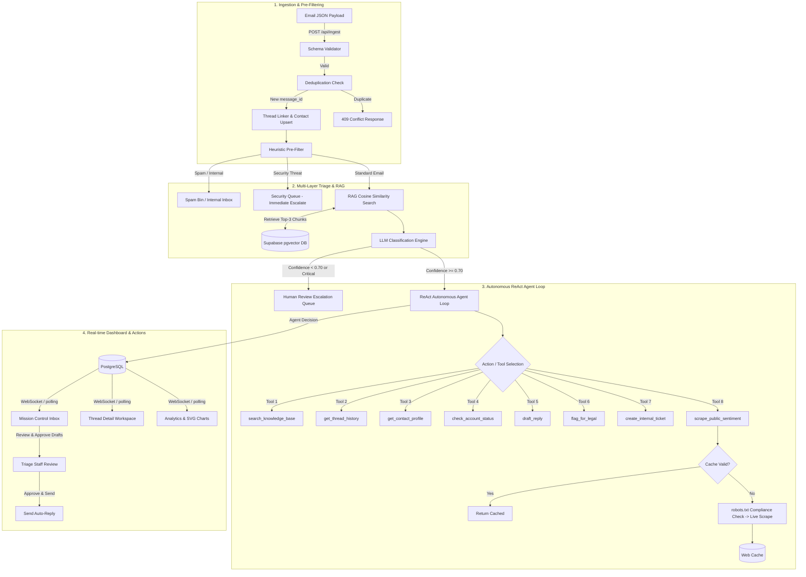

# SenAI Agentic CRM Intelligence Platform

A production-grade, AI-powered Customer Relationship Management (CRM) platform that autonomously monitors a high-volume email inbox, triages messages using multi-dimensional intelligence (heuristics, RAG, LLMs), runs an autonomous ReAct triage agent, scrapes public reputation sentiment (G2 & Trustpilot), and displays insights on a live dashboard.

---

## 🏗️ Architecture & Data Flow

The following Mermaid diagram outlines the complete system flow from ingestion to classification, tool utilization, database persistence, and dashboard updates.



---

## 🛠️ Technology Stack

*   **Backend**: Python (FastAPI) + Uvicorn + SQLAlchemy (Async) + Alembic
*   **Database & Vector Store**: Supabase PostgreSQL with `pgvector` extension
*   **AI Integration**: Groq (Llama-3.3-70B-Versatile) + SentenceTransformers (`all-MiniLM-L6-v2`)
*   **Frontend**: React (Vite) + TypeScript + Tailwind CSS v4 + Lucide Icons + custom SVG metrics charts
*   **Real-time Services**: Native WebSockets (`/ws`) for instant triage notification

---

## ⚙️ Environment Variables

The backend loads configuration from `backend/.env`. Below is the complete template of environment variables:

| Variable | Description | Default Value / Example |
| :--- | :--- | :--- |
| `DATABASE_URL` | PostgreSQL connection string (must support pgvector) | `postgresql+asyncpg://...` (Supabase pooler URL) |
| `GROQ_API_KEY` | API key to access Groq LLM inference services | `gsk_...` |
| `LLM_MODEL` | LLM model name used for agent decisions & templates | `llama-3.3-70b-versatile` |
| `EMBEDDING_MODEL` | Local SentenceTransformers model name for RAG | `all-MiniLM-L6-v2` |
| `EMBEDDING_DIMENSION` | Dimensionality of embeddings generated by the model | `384` |
| `KNOWLEDGE_BASE_DIR` | Directory containing policy markdown files to seed | `../../knowledge_base` |
| `EMAIL_DATA_FILE` | Filename containing raw emails for simulation | `email-data-advanced.json` |
| `SCRAPE_CACHE_TTL_HOURS` | Lifetime of reputation scraper records inside DB cache | `6` |
| `SCRAPE_TIMEOUT_SECONDS`| Scraping client timeout in seconds | `10` |
| `PORT` | API server listen port | `8000` |
| `FRONTEND_URL` | Host address of React client to allow CORS requests | `http://localhost:3000` or `http://localhost:5173` |
| `SIMULATION_SPEED` | Default streaming speed for simulator (emails/sec) | `1.0` |

---

## 🚀 Step-by-Step Setup Guide

### Prerequisites
*   Python 3.11+
*   Node.js 18+ & npm
*   A running PostgreSQL database with the `pgvector` extension installed.

### 1. Set Up the Database Schema
1.  Navigate to the `backend` directory:
    ```bash
    cd backend
    ```
2.  Make sure your virtual environment is active and dependencies are installed:
    ```bash
    uv venv
    .venv\Scripts\activate
    pip install -r requirements.txt
    ```
3.  Apply DB migrations:
    ```bash
    alembic upgrade head
    ```

### 2. Seed the Knowledge Base
Seed the pgvector store with vector embeddings derived from the policy files inside the `knowledge_base` directory:
```bash
python -m scripts.seed_kb
```

### 3. Start the Backend API Server
Start the Uvicorn server on port 8000:
```bash
python -m uvicorn app.main:app --host 127.0.0.1 --port 8000
```
Interactive documentation is now live at: **[http://127.0.0.1:8000/docs](http://127.0.0.1:8000/docs)**.

### 4. Run the Email Simulator
In a separate terminal window, navigate to the `backend/` directory and run:
```bash
python -m scripts.simulate_emails --speed 2.0
```
This replays the `email-data-advanced.json` dataset chronologically and streams the emails into the platform.

### 5. Run the React Frontend Dashboard
1.  Open a new terminal and navigate to the `frontend/` directory:
    ```bash
    cd frontend
    ```
2.  Install packages:
    ```bash
    npm install
    ```
3.  Launch the development server:
    ```bash
    npm run dev
    ```
4.  Open the web interface at: **[http://localhost:5173](http://localhost:5173)**.

---

## ⚙️ Design & Architectural Decisions

### 1. Multi-Layer Intelligence Engine
*   **Layer 1 (Heuristic pre-filter)**: Runs instantly (<10ms) synchronously. It checks domains, blocklists, and immediate security flags (ransomware, outages) to prevent slow API response times or auto-replying to attackers.
*   **Layer 2 (LLM Classifier + RAG)**: Queries the vector DB using `all-MiniLM-L6-v2` for semantic context and appends policies directly inside the LLM prompt. If confidence drops below `0.70`, the email is routed to the human queue.
*   **Layer 3 (Sentiment deterioration tracking)**: Keeps a rolling calculation of a contact's last emails. If 3 consecutive emails fall below `-0.3`, it increments the churn risk by `+0.2` and broadcasts a real-time warning.

### 2. ReAct Autonomous Agent Pattern
The agent uses a step-by-step reasoning cycle (Thought -> Action -> Observation -> Next) capped at `6` steps. If unresolved by then, it auto-escalates to human. It has access to 8 tools ranging from CRM lookups to active web reputation scraping.

### 3. Caching and robots.txt Compliance for Scraping
Scraping public ratings (G2, Trustpilot) runs asynchronously. It first checks `robots.txt` using a non-blocking threadpool parser, and caches successful scrapes for 6 hours to prevent rate limits or blocking.

---

## ⚠️ Known Limitations & Assumptions
1.  **Mock Scraper**: Since G2 and Trustpilot have active anti-bot systems, the live scraping module fetches review counts and ratings using JSON-LD metadata and regex. If anti-bot blocks the request, it degrades gracefully and falls back to mock stats without throwing errors.
2.  **Local Embeddings**: The system uses `all-MiniLM-L6-v2` locally to generate embeddings instead of paying for OpenAI's endpoint, providing fast, cost-effective vector search.
3.  **Vector Search Indexing**: For small datasets (such as our 79 chunks knowledge base), a pgvector `ivfflat` index can contain empty lists when built prior to insertion or when data volume is small, causing vector queries to return empty sets. To ensure absolute query precision, we commented out the `ivfflat` index from migrations and schema. This forces PostgreSQL to perform a sequential scan, which executes in <5ms (well within the <200ms requirement) and guarantees exact similarity search results.
